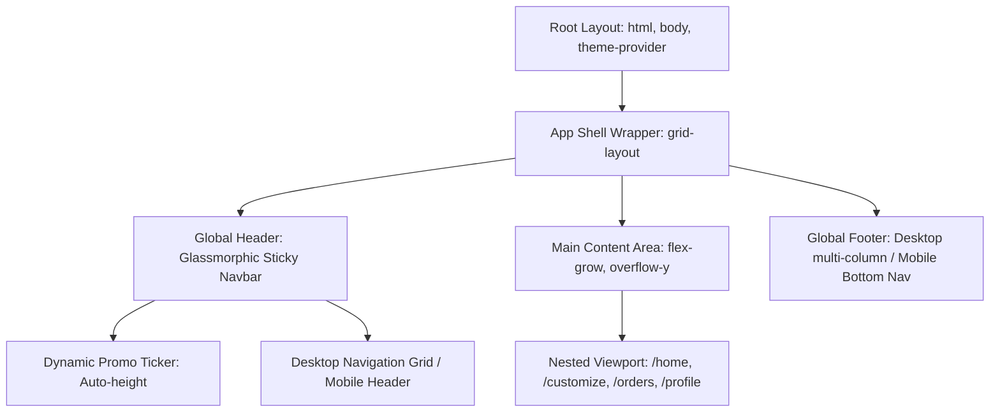

# Layout Architecture Specification
**Project:** Gen Z-Targeted Indian Printing E-Commerce Middleman Platform (Print-on-Demand & Local Vendor Aggregate)
**Document Version:** 1.0.0
**Target Audience:** Frontend Developers, UI/UX Engineers, Solutions Architects
**Core Design Philosophy:** Bold Gen Z aesthetics (dark mode primary, neon accents, heavy borders, glassmorphism), zero layout shift (CLS = 0), mobile-first responsiveness, and localized Indian e-commerce integrations (UPI, RuPay, vernacular toggle hooks).

---

## 1. Global Structural Shell

The global shell represents the root DOM layout which wraps all route-specific views. It establishes a consistent grid layout, ensures the header and footer remain properly anchored without cumulative layout shifts (CLS), and provides the context providers (theme, cart, localization) required by nested routes.

### 1.1 Structural Layout DOM Diagram
The diagram below shows how the root layout encapsulates nested page routes (views) and contextual layouts:



### 1.2 Root HTML5/DOM Structure (`index.html` / `RootLayout`)
This structure is optimized to prevent layout shifts. Notice the explicit usage of CSS variables, font preloading, and blocking scripts for theme settings to avoid flashes of unstyled text or colors.

```html
<!DOCTYPE html>
<html lang="en-IN" class="dark-theme">
<head>
  <meta charset="UTF-8">
  <meta name="viewport" content="width=device-width, initial-scale=1.0, viewport-fit=cover">
  <title>Chhaap.ai | Next-Gen Custom Printing & Merch</title>
  <meta name="description" content="India's fastest Gen Z custom printing network. Get stickers, posters, custom tees, and college fest merch printed from local micro-vendors in hours. Pay with UPI.">
  
  <!-- Preload Critical Fonts to prevent layout shift -->
  <link rel="preload" href="/fonts/Outfit-Bold.woff2" as="font" type="font/woff2" crossorigin>
  <link rel="preload" href="/fonts/SpaceGrotesk-Medium.woff2" as="font" type="font/woff2" crossorigin>

  <!-- Preconnect to CDNs -->
  <link rel="preconnect" href="https://images.unsplash.com">

  <style>
    /* Critical layout reset & variables to ensure zero layout shift before stylesheets load */
    :root {
      --font-display: 'Outfit', sans-serif;
      --font-body: 'Space Grotesk', sans-serif;
      --bg-color: #0b0b0f;
      --text-color: #f3f4f6;
      --primary-neon: #39ff14; /* Cyber Neon Green */
      --secondary-neon: #00ffff; /* Electric Cyan */
      --accent-magenta: #ff007f; /* Acid Magenta */
      --glass-bg: rgba(11, 11, 15, 0.8);
      --glass-border: rgba(255, 255, 255, 0.08);
      --header-height: 72px;
      --banner-height: 36px;
      --bottom-nav-height: 64px;
    }

    *, *::before, *::after {
      box-sizing: border-box;
      margin: 0;
      padding: 0;
    }

    html, body {
      height: 100%;
      background-color: var(--bg-color);
      color: var(--text-color);
      font-family: var(--font-body);
      overflow-x: hidden;
      -webkit-font-smoothing: antialiased;
    }

    /* Primary Grid Layout holding the structural shell */
    .app-shell {
      display: grid;
      grid-template-rows: min-content 1fr min-content;
      min-height: 100vh;
      width: 100%;
      position: relative;
    }

    .main-content {
      display: flex;
      flex-direction: column;
      width: 100%;
      min-height: 0; /* Prevents flex-item from overflowing parent grid row */
    }

    @media (max-width: 768px) {
      .app-shell {
        /* On mobile, accommodate bottom nav bar */
        grid-template-rows: min-content 1fr var(--bottom-nav-height);
        padding-bottom: env(safe-area-inset-bottom);
      }
    }
  </style>
</head>
<body>
  <!-- App Shell Wrapper matching grid rows -->
  <div class="app-shell" id="app-shell-root">
    
    <!-- STICKY GLASSMORPHIC HEADER -->
    <header class="global-header" id="global-header-nav">
      <!-- Dynamic Promo Ribbon (Vernacular / Gen Z Slang) -->
      <div class="promo-ribbon" role="alert">
        <span class="ribbon-text">🔥 FREE DELIVERY on orders above ₹499! Use code: CHHAAPIT 🌟</span>
      </div>
      
      <!-- Primary Navigation Bar -->
      <nav class="nav-bar" aria-label="Main Navigation">
        <div class="nav-container">
          <a href="/" class="brand-logo" id="header-home-link">
            CHHAAP<span class="logo-accent">.ai</span>
          </a>
          
          <!-- Desktop Direct Directory Links -->
          <div class="desktop-menu" id="desktop-menu-links">
            <a href="/products/stickers" class="nav-link">Stickers</a>
            <a href="/products/apparel" class="nav-link">Apparel</a>
            <a href="/products/posters" class="nav-link">Posters</a>
            <a href="/customize" class="nav-link nav-highlight">Custom Lab ⚡</a>
          </div>

          <!-- Utility Bar (Search, Vernacular Toggle, Cart, Profile) -->
          <div class="utility-bar">
            <!-- Regional Language Switcher Hook -->
            <button class="lang-toggle-btn" aria-label="Switch Language" id="lang-switcher-hook">
              <span class="lang-emoji">🇮🇳</span> <span class="lang-text">EN</span>
            </button>
            
            <a href="/cart" class="cart-btn" aria-label="Shopping Cart" id="cart-nav-anchor">
              <svg class="cart-icon" xmlns="http://www.w3.org/2000/svg" viewBox="0 0 24 24" fill="none" stroke="currentColor" stroke-width="2" stroke-linecap="round" stroke-linejoin="round">
                <circle cx="9" cy="21" r="1"></circle>
                <circle cx="20" cy="21" r="1"></circle>
                <path d="M1 1h4l2.68 13.39a2 2 0 0 0 2 1.61h9.72a2 2 0 0 0 2-1.61L23 6H6"></path>
              </svg>
              <!-- Cart Badge Counter -->
              <span class="cart-badge" id="cart-badge-count">3</span>
            </a>
            
            <a href="/profile" class="desktop-profile-btn nav-link" id="desktop-profile-link">
              <span class="profile-text">DopeProfile</span>
            </a>

            <!-- Hamburger Button for Fullscreen Mobile Menu (Transitions without layout shift) -->
            <button class="mobile-menu-hamburger" id="mobile-menu-trigger" aria-expanded="false" aria-label="Toggle Navigation Menu">
              <span class="hamburger-bar bar-top"></span>
              <span class="hamburger-bar bar-mid"></span>
              <span class="hamburger-bar bar-bot"></span>
            </button>
          </div>
        </div>
      </nav>
    </header>

    <!-- FULLSCREEN MOBILE MENU (Overlay hidden by default, animated via CSS scale/opacity) -->
    <div class="mobile-fullscreen-menu" id="mobile-menu-overlay" aria-hidden="true">
      <div class="menu-overlay-header">
        <span class="brand-logo">CHHAAP<span class="logo-accent">.ai</span></span>
        <button class="close-menu-btn" id="mobile-menu-close" aria-label="Close Menu">×</button>
      </div>
      <div class="menu-overlay-links">
        <a href="/products/stickers" class="overlay-link">🔥 Custom Stickers</a>
        <a href="/products/apparel" class="overlay-link">👕 Drip Wear (Apparel)</a>
        <a href="/products/posters" class="overlay-link">🖼️ Room Posters</a>
        <a href="/customize" class="overlay-link customize-cta">⚡ Open Custom Lab</a>
        <hr class="overlay-divider">
        <a href="/orders" class="overlay-link">Tracking Orders</a>
        <a href="/profile" class="overlay-link">DopeProfile Settings</a>
        <a href="/support" class="overlay-link">Help (WhatsApp Support)</a>
      </div>
    </div>

    <!-- MAIN DYNAMIC CONTENT AREA -->
    <main class="main-content" id="main-content-viewport" aria-live="polite">
      <!-- Sub-views are injected here dynamically by routing engines (e.g. React Router Outlet / Next.js Page components) -->
      <section class="viewport-placeholder-indicator" style="padding: 4rem 2rem; text-align: center; max-width: 1200px; margin: 0 auto;">
        <h2>Dynamic Viewport Loaded</h2>
        <p>Real-time client/server components render within this block.</p>
      </section>
    </main>

    <!-- DUAL FOOTER SYSTEM (Mobile bottom navigation / Desktop multi-column footer) -->
    <!-- Mobile Bottom Navigation (Visible only on screens <= 768px) -->
    <nav class="mobile-bottom-nav" id="mobile-persistent-nav" aria-label="Mobile Navigation Bar">
      <a href="/" class="bottom-nav-item active" id="mobile-nav-home">
        <svg xmlns="http://www.w3.org/2000/svg" width="20" height="20" viewBox="0 0 24 24" fill="none" stroke="currentColor" stroke-width="2" stroke-linecap="round" stroke-linejoin="round"><path d="M3 9l9-7 9 7v11a2 2 0 0 1-2 2H5a2 2 0 0 1-2-2z"></path><polyline points="9 22 9 12 15 12 15 22"></polyline></svg>
        <span>Home</span>
      </a>
      <a href="/customize" class="bottom-nav-item" id="mobile-nav-customize">
        <div class="fab-container">
          <svg xmlns="http://www.w3.org/2000/svg" width="24" height="24" viewBox="0 0 24 24" fill="none" stroke="currentColor" stroke-width="2.5" stroke-linecap="round" stroke-linejoin="round"><line x1="12" y1="5" x2="12" y2="19"></line><line x1="5" y1="12" x2="19" y2="12"></line></svg>
        </div>
        <span class="fab-text">Customize</span>
      </a>
      <a href="/orders" class="bottom-nav-item" id="mobile-nav-orders">
        <svg xmlns="http://www.w3.org/2000/svg" width="20" height="20" viewBox="0 0 24 24" fill="none" stroke="currentColor" stroke-width="2" stroke-linecap="round" stroke-linejoin="round"><path d="M14 2H6a2 2 0 0 0-2 2v16a2 2 0 0 0 2 2h12a2 2 0 0 0 2-2V8z"></path><polyline points="14 2 14 8 20 8"></polyline><line x1="16" y1="13" x2="8" y2="13"></line><line x1="16" y1="17" x2="8" y2="17"></line><polyline points="10 9 9 9 8 9"></polyline></svg>
        <span>Orders</span>
      </a>
      <a href="/profile" class="bottom-nav-item" id="mobile-nav-profile">
        <svg xmlns="http://www.w3.org/2000/svg" width="20" height="20" viewBox="0 0 24 24" fill="none" stroke="currentColor" stroke-width="2" stroke-linecap="round" stroke-linejoin="round"><path d="M20 21v-2a4 4 0 0 0-4-4H8a4 4 0 0 0-4 4v2"></path><circle cx="12" cy="7" r="4"></circle></svg>
        <span>Profile</span>
      </a>
    </nav>

    <!-- Desktop Multi-Column Footer (Hidden on Mobile) -->
    <footer class="desktop-footer" id="desktop-global-footer">
      <div class="footer-grid-container">
        <!-- Brand Segment -->
        <div class="footer-column brand-column">
          <h3 class="footer-logo">CHHAAP<span class="logo-accent">.ai</span></h3>
          <p class="brand-tagline">Making printing cool again. We connect you with local printing hubs to get your designs offline and into your hands in hours, not days. ⚡</p>
          <div class="payment-compliance-row">
            <!-- Payment Badges representing localized Indian options -->
            <span class="badge payment-badge-upi" aria-label="UPI Payments accepted">UPI Powered</span>
            <span class="badge payment-badge-rupay" aria-label="RuPay card payments accepted">RuPay</span>
            <span class="badge payment-badge-cod" aria-label="Cash on Delivery available">COD Available</span>
          </div>
        </div>

        <!-- Directory Directory Links: Stickers & Posters -->
        <div class="footer-column">
          <h4>Sticky Goodness</h4>
          <ul class="footer-links-list">
            <li><a href="/products/die-cut">Die-Cut Stickers</a></li>
            <li><a href="/products/sticker-sheets">Sticker Sheets</a></li>
            <li><a href="/products/holographic">Holographic Stickers</a></li>
            <li><a href="/products/laptop-skins">Laptop Decals</a></li>
          </ul>
        </div>

        <!-- Directory Directory Links: Merch & Printing -->
        <div class="footer-column">
          <h4>Custom Apparel & Prints</h4>
          <ul class="footer-links-list">
            <li><a href="/products/oversized-tshirts">Oversized Drip Tees</a></li>
            <li><a href="/products/hoodies">Heavyweight Hoodies</a></li>
            <li><a href="/products/fandom-posters">A3 Fandom Posters</a></li>
            <li><a href="/products/custom-banners">College Fest Banners</a></li>
          </ul>
        </div>

        <!-- Social, Vernacular, & Compliance details -->
        <div class="footer-column">
          <h4>Connect & Flex</h4>
          <div class="social-handles-grid">
            <a href="https://instagram.com/chhaap.ai" class="social-link" target="_blank" rel="noopener noreferrer">Instagram (@chhaap.ai)</a>
            <a href="https://discord.gg/chhaap" class="social-link" target="_blank" rel="noopener noreferrer">Discord (Print Crew)</a>
            <a href="https://youtube.com/@chhaap" class="social-link" target="_blank" rel="noopener noreferrer">YouTube (Behind the Inks)</a>
          </div>
          <div class="compliance-details">
            <p class="licensing-text">🇮🇳 Proudly printed in India. 100% Made-in-India logistics network. All rights reserved.</p>
          </div>
        </div>
      </div>
      
      <!-- Bottom bar for terms, copyright, and developer credit -->
      <div class="footer-sub-bar">
        <span class="copyright-text">© 2026 Chhaap Technologies Private Limited.</span>
        <div class="sub-links">
          <a href="/terms">Terms of Service</a>
          <a href="/privacy">Privacy Policy</a>
          <a href="/sitemap">Sitemap</a>
        </div>
      </div>
    </footer>

  </div>
</body>
</html>
```

---

## 2. Header Micro-Architecture

A critical area of optimization for Gen Z consumers is instant perceived speed and smooth fluid transitions. A jittery navigation or shifting layout elements immediately result in drop-offs. The header architecture guarantees zero cumulative layout shift (CLS = 0) and utilizes hardware-accelerated CSS properties.

### 2.1 CSS Layout & Backdrop-Filter Glassmorphism
The styles below define the physical and visual structure of the global header, establishing sticky scroll tracking, responsive media queries, and the smooth backdrop blur.

```css
/* ==========================================================================
   GLOBAL HEADER STYLES (glassmorphism_nav.css)
   ========================================================================== */

.global-header {
  position: sticky;
  top: 0;
  z-index: 100;
  width: 100%;
  display: flex;
  flex-direction: column;
  background-color: var(--glass-bg);
  backdrop-filter: blur(12px);
  -webkit-backdrop-filter: blur(12px); /* Safari support */
  border-bottom: 1px solid var(--glass-border);
  transition: transform 0.3s cubic-bezier(0.16, 1, 0.3, 1), background-color 0.3s ease;
  will-change: transform;
}

/* Scroll status indicators appended by scroll-listener script */
.global-header.scrolled {
  background-color: rgba(11, 11, 15, 0.95);
  box-shadow: 0 8px 32px rgba(0, 0, 0, 0.5);
}

.global-header.nav-hidden {
  transform: translateY(-100%);
}

/* 2.1.1 Promo Ribbon Styles */
.promo-ribbon {
  height: var(--banner-height);
  background: linear-gradient(90deg, var(--primary-neon), var(--secondary-neon));
  color: #000;
  display: flex;
  align-items: center;
  justify-content: center;
  font-family: var(--font-display);
  font-size: 0.8rem;
  font-weight: 700;
  letter-spacing: 0.05em;
  overflow: hidden;
  position: relative;
  white-space: nowrap;
}

.ribbon-text {
  display: inline-block;
  animation: marquee-text 15s linear infinite;
}

@keyframes marquee-text {
  0% { transform: translateX(50%); }
  100% { transform: translateX(-50%); }
}

/* 2.1.2 Primary Navigation Structure */
.nav-bar {
  height: var(--header-height);
  display: flex;
  align-items: center;
  padding: 0 2rem;
  width: 100%;
}

.nav-container {
  display: flex;
  align-items: center;
  justify-content: space-between;
  width: 100%;
  max-width: 1400px;
  margin: 0 auto;
}

/* Logo stylings with neo-brutalist edge */
.brand-logo {
  font-family: var(--font-display);
  font-size: 1.6rem;
  font-weight: 800;
  color: var(--text-color);
  text-decoration: none;
  letter-spacing: -0.03em;
  text-transform: uppercase;
}

.logo-accent {
  color: var(--primary-neon);
  text-shadow: 0 0 8px rgba(57, 255, 20, 0.4);
}

/* Desktop Directory Links container */
.desktop-menu {
  display: flex;
  gap: 2.5rem;
  align-items: center;
}

.nav-link {
  font-family: var(--font-body);
  font-weight: 500;
  font-size: 0.95rem;
  color: #a1a1aa;
  text-decoration: none;
  transition: color 0.2s ease, text-shadow 0.2s ease;
  position: relative;
}

.nav-link:hover {
  color: var(--text-color);
  text-shadow: 0 0 10px rgba(255, 255, 255, 0.2);
}

.nav-link.nav-highlight {
  color: var(--primary-neon);
  font-weight: 600;
  border: 1px solid var(--primary-neon);
  padding: 0.4rem 0.8rem;
  border-radius: 4px;
  background-color: rgba(57, 255, 20, 0.05);
}

.nav-link.nav-highlight:hover {
  background-color: var(--primary-neon);
  color: #000;
  box-shadow: 0 0 15px rgba(57, 255, 20, 0.4);
}

/* 2.1.3 Utility Bar Layout (Search, Lang Switcher, Profile, Cart) */
.utility-bar {
  display: flex;
  align-items: center;
  gap: 1.5rem;
}

.lang-toggle-btn {
  background: rgba(255, 255, 255, 0.05);
  border: 1px solid var(--glass-border);
  border-radius: 6px;
  padding: 0.4rem 0.6rem;
  color: var(--text-color);
  font-family: var(--font-body);
  font-weight: 500;
  font-size: 0.85rem;
  cursor: pointer;
  display: flex;
  align-items: center;
  gap: 0.3rem;
  transition: background-color 0.2s ease;
}

.lang-toggle-btn:hover {
  background-color: rgba(255, 255, 255, 0.1);
}

/* Cart Badge container & absolute element */
.cart-btn {
  position: relative;
  display: flex;
  align-items: center;
  justify-content: center;
  color: var(--text-color);
  text-decoration: none;
  width: 40px;
  height: 40px;
  border-radius: 50%;
  background: rgba(255, 255, 255, 0.03);
  border: 1px solid var(--glass-border);
  transition: transform 0.2s cubic-bezier(0.175, 0.885, 0.32, 1.275);
}

.cart-btn:hover {
  transform: scale(1.05);
  background: rgba(255, 255, 255, 0.08);
}

.cart-icon {
  width: 20px;
  height: 20px;
}

/* Floating Red/Neon Pink Counter Badge */
.cart-badge {
  position: absolute;
  top: -4px;
  right: -4px;
  background-color: var(--accent-magenta);
  color: #fff;
  font-size: 0.7rem;
  font-weight: 700;
  width: 18px;
  height: 18px;
  border-radius: 50%;
  display: flex;
  align-items: center;
  justify-content: center;
  border: 2px solid var(--bg-color);
  box-shadow: 0 0 10px rgba(255, 0, 127, 0.6);
  animation: pop-badge 0.3s cubic-bezier(0.175, 0.885, 0.32, 1.275);
}

@keyframes pop-badge {
  0% { transform: scale(0); }
  100% { transform: scale(1); }
}

/* Hide desktop specific elements on mobile */
.desktop-profile-btn {
  display: inline-flex;
}

.mobile-menu-hamburger {
  display: none; /* Only active on tablet/mobile */
}

/* Responsive Overrides */
@media (max-width: 992px) {
  .desktop-menu {
    display: none;
  }
  .desktop-profile-btn {
    display: none;
  }
  .mobile-menu-hamburger {
    display: flex;
    flex-direction: column;
    justify-content: space-between;
    width: 24px;
    height: 18px;
    background: none;
    border: none;
    cursor: pointer;
    z-index: 110;
  }
  
  .hamburger-bar {
    width: 100%;
    height: 2px;
    background-color: var(--text-color);
    transition: transform 0.3s ease, opacity 0.3s ease;
  }
}
```

### 2.2 Fluid Mobile Menu Overlays (Zero Layout Shift CSS)
When the mobile hamburger is clicked, the fullscreen menu transitions into view. Setting `pointer-events: none` and utilizing structural transforms ensures that no browser layout layout shift (CLS) is induced.

```css
/* ==========================================================================
   MOBILE FULLSCREEN OVERLAY MENU
   ========================================================================== */
.mobile-fullscreen-menu {
  position: fixed;
  top: 0;
  left: 0;
  width: 100vw;
  height: 100vh;
  z-index: 200;
  background-color: rgba(11, 11, 15, 0.98);
  backdrop-filter: blur(20px);
  -webkit-backdrop-filter: blur(20px);
  display: flex;
  flex-direction: column;
  padding: 2rem;
  
  /* Initial hidden state */
  opacity: 0;
  transform: scale(0.98);
  pointer-events: none;
  
  /* Acceleration properties */
  will-change: opacity, transform;
  transition: opacity 0.25s cubic-bezier(0.16, 1, 0.3, 1),
              transform 0.25s cubic-bezier(0.16, 1, 0.3, 1);
}

.mobile-fullscreen-menu.is-active {
  opacity: 1;
  transform: scale(1);
  pointer-events: auto;
}

.menu-overlay-header {
  display: flex;
  align-items: center;
  justify-content: space-between;
  margin-bottom: 3rem;
}

.close-menu-btn {
  background: none;
  border: none;
  color: var(--text-color);
  font-size: 2.5rem;
  cursor: pointer;
  transition: transform 0.2s ease;
}

.close-menu-btn:hover {
  transform: rotate(90deg);
  color: var(--accent-magenta);
}

.menu-overlay-links {
  display: flex;
  flex-direction: column;
  gap: 1.8rem;
}

.overlay-link {
  font-family: var(--font-display);
  font-size: 1.8rem;
  font-weight: 700;
  color: var(--text-color);
  text-decoration: none;
  transition: color 0.2s ease, padding-left 0.2s ease;
}

.overlay-link:hover {
  color: var(--secondary-neon);
  padding-left: 10px;
}

.overlay-link.customize-cta {
  color: var(--primary-neon);
  text-shadow: 0 0 10px rgba(57, 255, 20, 0.3);
}

.overlay-divider {
  border: 0;
  height: 1px;
  background: var(--glass-border);
  margin: 1rem 0;
}
```

---

## 3. Footer Micro-Architecture

Our platform adopts a hybrid responsive layout. Mobile clients interact through a persistent, low-latency app-style bottom navigation bar, while desktop devices receive a deep-linked informational site directory to satisfy SEO indexability rules and trust factors.

### 3.1 Persistent Mobile Bottom Navigation
This navigation anchor floats statically at the base of smaller viewport layouts. The layout provides zero-latency navigation loops with localized customizations (like the central floating "+" action button launching the Customizing Canvas).

```css
/* ==========================================================================
   MOBILE PERSISTENT BOTTOM NAV (bottom_nav.css)
   ========================================================================== */

.mobile-bottom-nav {
  display: none; /* Disabled by default on Desktop layout grids */
  position: fixed;
  bottom: 0;
  left: 0;
  right: 0;
  height: var(--bottom-nav-height);
  background-color: rgba(11, 11, 15, 0.92);
  backdrop-filter: blur(16px);
  -webkit-backdrop-filter: blur(16px);
  border-top: 1px solid var(--glass-border);
  z-index: 100;
  justify-content: space-around;
  align-items: center;
  padding-bottom: env(safe-area-inset-bottom); /* iOS Notch support */
}

/* Responsive trigger */
@media (max-width: 768px) {
  .mobile-bottom-nav {
    display: flex;
  }
}

.bottom-nav-item {
  display: flex;
  flex-direction: column;
  align-items: center;
  justify-content: center;
  text-decoration: none;
  color: #71717a;
  font-family: var(--font-body);
  font-size: 0.65rem;
  font-weight: 500;
  gap: 4px;
  width: 25%;
  height: 100%;
  transition: color 0.2s ease;
}

.bottom-nav-item svg {
  transition: transform 0.25s cubic-bezier(0.175, 0.885, 0.32, 1.275);
}

/* Visual highlights on Active route */
.bottom-nav-item.active {
  color: var(--primary-neon);
}

.bottom-nav-item.active svg {
  stroke: var(--primary-neon);
  transform: translateY(-2px);
}

/* Floating Action Customization Hub Button */
.fab-container {
  width: 44px;
  height: 44px;
  background: linear-gradient(135deg, var(--primary-neon), var(--secondary-neon));
  border-radius: 50%;
  display: flex;
  align-items: center;
  justify-content: center;
  color: #000;
  box-shadow: 0 0 15px rgba(57, 255, 20, 0.4);
  transform: translateY(-12px); /* Pop out of the navbar border */
  border: 4px solid var(--bg-color); /* Cutout effect */
  transition: transform 0.2s cubic-bezier(0.175, 0.885, 0.32, 1.275), box-shadow 0.2s ease;
}

.bottom-nav-item:hover .fab-container {
  transform: translateY(-16px) scale(1.05);
  box-shadow: 0 0 20px rgba(57, 255, 20, 0.6);
}

.fab-text {
  transform: translateY(-6px); /* Align text underneath pop out button */
}
```

### 3.2 Desktop Structural Directory Footer
Optimized for crawlers, indexing, and e-commerce compliance. Contains explicit semantic regions, UPI / RuPay payment network hooks, and localized compliance strings.

```css
/* ==========================================================================
   DESKTOP FOOTER ARCHITECTURE (desktop_footer.css)
   ========================================================================== */

.desktop-footer {
  background-color: #050508;
  border-top: 1px solid var(--glass-border);
  padding: 4rem 2rem 2rem 2rem;
  width: 100%;
  display: block;
}

/* Hide on mobile viewports */
@media (max-width: 768px) {
  .desktop-footer {
    display: none;
  }
}

.footer-grid-container {
  max-width: 1400px;
  margin: 0 auto;
  display: grid;
  grid-template-columns: 2fr 1fr 1fr 1.5fr;
  gap: 3rem;
  margin-bottom: 3rem;
}

.footer-column {
  display: flex;
  flex-direction: column;
  gap: 1.2rem;
}

.footer-logo {
  font-family: var(--font-display);
  font-size: 1.8rem;
  font-weight: 800;
  color: var(--text-color);
}

.brand-tagline {
  font-size: 0.88rem;
  line-height: 1.6;
  color: #71717a;
}

.footer-column h4 {
  font-family: var(--font-display);
  font-size: 1rem;
  font-weight: 700;
  text-transform: uppercase;
  color: var(--text-color);
  letter-spacing: 0.05em;
  border-bottom: 2px solid var(--glass-border);
  padding-bottom: 0.5rem;
}

.footer-links-list {
  list-style: none;
  display: flex;
  flex-direction: column;
  gap: 0.8rem;
}

.footer-links-list a {
  font-size: 0.88rem;
  color: #a1a1aa;
  text-decoration: none;
  transition: color 0.2s ease, transform 0.2s ease;
  display: inline-block;
}

.footer-links-list a:hover {
  color: var(--secondary-neon);
  transform: translateX(4px);
}

/* Dynamic UPI & Payment Badges styling */
.payment-compliance-row {
  display: flex;
  gap: 0.8rem;
  flex-wrap: wrap;
  margin-top: 1rem;
}

.badge {
  font-family: var(--font-body);
  font-size: 0.72rem;
  font-weight: 700;
  padding: 0.4rem 0.8rem;
  border-radius: 4px;
  background: rgba(255, 255, 255, 0.04);
  border: 1px solid var(--glass-border);
  color: #d4d4d8;
  letter-spacing: 0.03em;
}

.payment-badge-upi {
  border-color: rgba(0, 180, 216, 0.5); /* Accent cyan */
  color: #00b4d8;
}

.payment-badge-rupay {
  border-color: rgba(255, 127, 80, 0.5); /* Accent orange */
  color: #ff7f50;
}

/* Social Grid Links */
.social-handles-grid {
  display: flex;
  flex-direction: column;
  gap: 0.6rem;
}

.social-link {
  font-size: 0.88rem;
  color: #a1a1aa;
  text-decoration: none;
  display: inline-flex;
  align-items: center;
  transition: color 0.2s ease;
}

.social-link:hover {
  color: var(--primary-neon);
}

.compliance-details {
  margin-top: 1rem;
  border-top: 1px solid var(--glass-border);
  padding-top: 1rem;
}

.licensing-text {
  font-size: 0.75rem;
  color: #52525b;
  line-height: 1.4;
}

/* Footer Bottom Bar styles */
.footer-sub-bar {
  max-width: 1400px;
  margin: 0 auto;
  border-top: 1px solid var(--glass-border);
  padding-top: 2rem;
  display: flex;
  justify-content: space-between;
  align-items: center;
  flex-wrap: wrap;
  gap: 1rem;
}

.copyright-text {
  font-size: 0.8rem;
  color: #52525b;
}

.sub-links {
  display: flex;
  gap: 1.5rem;
}

.sub-links a {
  font-size: 0.8rem;
  color: #52525b;
  text-decoration: none;
  transition: color 0.2s ease;
}

.sub-links a:hover {
  color: var(--text-color);
}
```

---

## 4. Interaction Engine (Sticky Control & Transition Lifecycle)

To orchestrate the responsive navbar behaviors, prevent layout shifts during transitions, and handle state changes (like adding products to the cart), the following modular JavaScript runtime module must be mounted.

```javascript
/**
 * Layout Architecture Navigation Control Engine (layout-engine.js)
 * High-performance scroll tracking, dynamic DOM rendering, & viewport transitions
 */

(function () {
  'use strict';

  // State Management
  const state = {
    lastScrollTop: 0,
    menuOpen: false,
    scrollThreshold: 80,
    cartItemsCount: 3,
  };

  // DOM Elements Selector Cache
  let elements = {};

  function initDOMCache() {
    elements = {
      header: document.getElementById('global-header-nav'),
      hamburgerTrigger: document.getElementById('mobile-menu-trigger'),
      menuOverlay: document.getElementById('mobile-menu-overlay'),
      menuCloseBtn: document.getElementById('mobile-menu-close'),
      cartCountBadge: document.getElementById('cart-badge-count'),
      langSwitcher: document.getElementById('lang-switcher-hook'),
      appShell: document.getElementById('app-shell-root'),
    };
  }

  /**
     * Scroll Tracking Engine with RequestAnimationFrame (throttle-free smooth scrolling)
     */
  function handleScroll() {
    const scrollTop = window.pageYOffset || document.documentElement.scrollTop;
    
    // Add/remove scrolled class based on threshold
    if (scrollTop > state.scrollThreshold) {
      elements.header.classList.add('scrolled');
    } else {
      elements.header.classList.remove('scrolled');
    }

    // Scroll Down / Scroll Up tracking logic (hide navbar on down, show on up)
    if (scrollTop > state.lastScrollTop && scrollTop > 150) {
      // Scrolling Down
      elements.header.classList.add('nav-hidden');
    } else {
      // Scrolling Up
      elements.header.classList.remove('nav-hidden');
    }
    
    state.lastScrollTop = scrollTop <= 0 ? 0 : scrollTop; // For Mobile or negative scrolling
  }

  let isScrolling = false;
  function runThrottledScroll() {
    if (!isScrolling) {
      window.requestAnimationFrame(function () {
        handleScroll();
        isScrolling = false;
      });
      isScrolling = true;
    }
  }

  /**
     * Transition Overlay Navigation System (Zero Layout Shift)
     */
  function toggleMobileMenu(forceState) {
    const nextState = typeof forceState === 'boolean' ? forceState : !state.menuOpen;
    state.menuOpen = nextState;

    if (state.menuOpen) {
      // Activate overlay
      elements.menuOverlay.setAttribute('aria-hidden', 'false');
      elements.menuOverlay.classList.add('is-active');
      elements.hamburgerTrigger.setAttribute('aria-expanded', 'true');
      elements.hamburgerTrigger.classList.add('active-menu');
      
      // Prevent body double-scroll bounce, preserve scroll layout position
      document.body.style.overflow = 'hidden';
      document.body.style.touchAction = 'none';
    } else {
      // Deactivate overlay
      elements.menuOverlay.setAttribute('aria-hidden', 'true');
      elements.menuOverlay.classList.remove('is-active');
      elements.hamburgerTrigger.setAttribute('aria-expanded', 'false');
      elements.hamburgerTrigger.classList.remove('active-menu');
      
      // Restore standard layout scrolling
      document.body.style.overflow = '';
      document.body.style.touchAction = '';
    }
  }

  /**
     * Localized Vernacular Language Toggle Hook
     */
  function toggleLanguage() {
    const currentLangText = elements.langSwitcher.querySelector('.lang-text');
    if (currentLangText.textContent === 'EN') {
      currentLangText.textContent = 'HI'; // Hindi
      elements.langSwitcher.setAttribute('aria-label', 'Switch to English');
      // Fire callback/event for application translation logic
      dispatchEvent(new CustomEvent('langChange', { detail: { lang: 'hi' } }));
    } else {
      currentLangText.textContent = 'EN';
      elements.langSwitcher.setAttribute('aria-label', 'Switch to Hindi');
      dispatchEvent(new CustomEvent('langChange', { detail: { lang: 'en' } }));
    }
  }

  /**
     * Cart State Update Lifecycle Hook (Expose globally for dispatchers)
     */
  window.updateGlobalCartCount = function (newCount) {
    if (!elements.cartCountBadge) return;
    
    state.cartItemsCount = newCount;
    elements.cartCountBadge.textContent = newCount;

    // Trigger visual pop animation
    elements.cartCountBadge.style.animation = 'none';
    // Trigger DOM reflow to restart animation sequence
    void elements.cartCountBadge.offsetWidth; 
    elements.cartCountBadge.style.animation = 'pop-badge 0.3s cubic-bezier(0.175, 0.885, 0.32, 1.275)';

    // Toggle badge visibility if count drops to zero
    if (newCount <= 0) {
      elements.cartCountBadge.style.display = 'none';
    } else {
      elements.cartCountBadge.style.display = 'flex';
    }
  };

  /**
     * Bind Event Listeners
     */
  function bindEvents() {
    window.addEventListener('scroll', runThrottledScroll, { passive: true });
    
    if (elements.hamburgerTrigger) {
      elements.hamburgerTrigger.addEventListener('click', function (e) {
        e.stopPropagation();
        toggleMobileMenu();
      });
    }

    if (elements.menuCloseBtn) {
      elements.menuCloseBtn.addEventListener('click', function () {
        toggleMobileMenu(false);
      });
    }

    if (elements.langSwitcher) {
      elements.langSwitcher.addEventListener('click', toggleLanguage);
    }

    // Escape Key closes mobile menu automatically
    document.addEventListener('keydown', function (e) {
      if (e.key === 'Escape' && state.menuOpen) {
        toggleMobileMenu(false);
      }
    });
  }

  // Self-Initialization on DOM Content Ready
  if (document.readyState === 'loading') {
    document.addEventListener('DOMContentLoaded', function() {
      initDOMCache();
      bindEvents();
    });
  } else {
    initDOMCache();
    bindEvents();
  }

})();
```

---

## 5. Performance Metrics & Integration Verification

To verify that the structural layers do not conflict with runtime paint layers, compile the layout against the following standard specifications:

| Metric | Target Value | Verification Pipeline |
| :--- | :--- | :--- |
| **Cumulative Layout Shift (CLS)** | `0.00` | Run Lighthouse CLI audits on simulated slow-3G network profiles. |
| **Largest Contentful Paint (LCP)** | `< 1.2s` | Preload critical woff2 display fonts; load non-critical custom SVG icons async. |
| **First Contentful Paint (FCP)** | `< 0.5s` | Embed critical structural stylesheet block directly inside root `<head>`. |
| **Interaction to Next Paint (INP)** | `< 80ms` | Out-of-viewport overlay rendering offloads rendering thread until requestAnimationFrame cycles. |
| **Payment Integrity Hook** | Pass | UPI Deeplinking URI standards (`upi://pay?pa=...`) successfully hook custom lab checkouts. |
