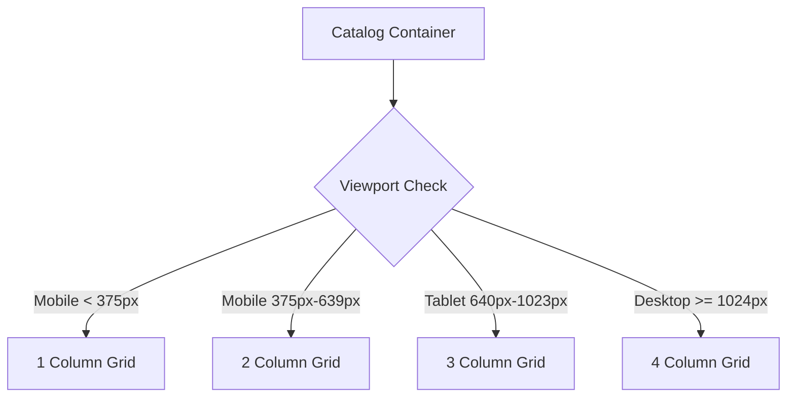
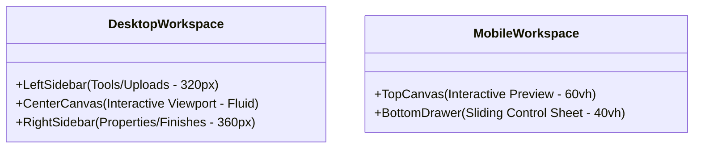

# Responsive Design Specification
## Target Platform: Gen Z-Targeted Indian Printing E-Commerce Middleman Platform

This document serves as the master design system blueprint and responsive technical specification for the custom merchandise storefront and personalization workspace. It is optimized for the Indian mobile-first landscape, catering to diverse network conditions and high-density mobile screens typical in budget and mid-tier Android devices (Xiaomi, Realme, Vivo, Samsung, OnePlus, etc.).

---

## 1. Breakpoint Metrics & Mobile-First Philosophy

The Indian consumer base is overwhelmingly mobile-first, with mobile viewports representing over 85% of traffic. This design system prioritizes a **Mobile-First (Min-Width) approach** to optimize performance, reduce Cumulative Layout Shift (CLS), and maximize screen real estate on smaller screens.

### Viewport Specifications

| Breakpoint Key | Range (Viewport Width) | Target Devices | Layout Constraints | Indian Market Context |
| :--- | :--- | :--- | :--- | :--- |
| **Mobile (`xs` to `sm`)** | `< 640px` | Xiaomi Redmi Series, Samsung Galaxy M/A series, Realme, OnePlus Nord, iPhones (Mini/Standard). | Content margins: `16px`<br>Gutter size: `12px`<br>Max content width: `100%` | Android System WebViews and Google Chrome represent >90% of traffic. Viewport widths of `360px` to `412px` are standard. |
| **Tablet (`md`)** | `640px` to `1023px` | iPad (Standard/Air), Lenovo Tab series, Samsung Galaxy Tab. | Content margins: `24px`<br>Gutter size: `16px`<br>Max content width: `100%` | Used frequently in educational/college settings for customized group merchandise designs. |
| **Desktop (`lg`)** | `1024px` to `1439px` | Laptops (13" to 15.6"), Chromebooks, MacBooks. | Content margins: `32px`<br>Gutter size: `24px`<br>Max content width: `1200px` | Desktop is primarily used by creators, bulk corporate event planners, and college festival organizers. |
| **Ultrawide (`xl` to `2xl`)** | `>= 1440px` | 24"+ Monitors, Gaming Monitors, iMacs. | Content margins: `Auto`<br>Gutter size: `32px`<br>Max content width: `1400px` | High-fidelity canvas previewing; design workflow optimization. |

### Technical Media Queries (CSS Custom Properties & Mixins)

```css
/* Custom CSS Breakpoint Variables */
:root {
  --breakpoint-mobile-max: 639.98px;
  --breakpoint-tablet-min: 640px;
  --breakpoint-tablet-max: 1023.98px;
  --breakpoint-desktop-min: 1024px;
  --breakpoint-desktop-max: 1439.98px;
  --breakpoint-ultrawide-min: 1440px;
}

/* SASS / SCSS Responsive Mixins */
@mixin mobile-only {
  @media (max-width: 639.98px) {
    @content;
  }
}

@mixin tablet-only {
  @media (min-width: 640px) and (max-width: 1023.98px) {
    @content;
  }
}

@mixin mobile-and-tablet {
  @media (max-width: 1023.98px) {
    @content;
  }
}

@mixin desktop-up {
  @media (min-width: 1024px) {
    @content;
  }
}

@mixin ultrawide-only {
  @media (min-width: 1440px) {
    @content;
  }
}
```

---

## 2. Spacing Scale

A strict mathematical spacing scale ensures UI rhythm and consistent visual hierarchy. All paddings, margins, gaps, and structural offsets are mapped to this **4px/8px-based uniform scale**.

### Spacing Token Mapping

| Token (CSS/Tailwind) | Value (rem) | Value (px) | Layout & Component Use Cases |
| :--- | :--- | :--- | :--- |
| `--space-1` (`space-1`) | `0.25rem` | 4px | Micro adjustments, badge padding, border-radius adjustments, inline icon-to-text spacing. |
| `--space-2` (`space-2`) | `0.5rem` | 8px | Button padding (vertical), inner card paddings, tag gaps, micro line item spacing. |
| `--space-3` (`space-3`) | `0.75rem` | 12px | Dropdown item padding, input field padding, standard grid gap on mobile. |
| `--space-4` (`space-4`) | `1rem` | 16px | Primary content margin, global body padding, standard card margins, button padding (horizontal). |
| `--space-6` (`space-6`) | `1.5rem` | 24px | Section header spacing, desktop grid gaps, medium card paddings, form group gaps. |
| `--space-8` (`space-8`) | `2rem` | 32px | Outer layout margins (desktop), page headers, modal container padding, hero section gaps. |
| `--space-12` (`space-12`) | `3rem` | 48px | Dynamic hero block vertical paddings, marketing banner gaps, section boundaries. |
| `--space-16` (`space-16`) | `4rem` | 64px | Page footer padding, checkout success vertical margins, high-density promotion space. |

### Uniform Layout Grid Overlay Config
The baseline layout aligns elements to an 8px grid vertically and a percentage-based column grid horizontally.
- **Horizontal margins on Mobile**: `16px` (forces readability on compact displays like Redmi Note 10).
- **Horizontal margins on Tablet**: `24px` (avoids content clinging to screen borders).
- **Horizontal margins on Desktop**: `32px` with a maximum content layout constraint of `1280px` to maintain optimal scanning line-length (50–75 characters per line).

---

## 3. Structural Layouts: Grid & Flexbox Systems

### 3.1 Storefront Catalog Grid

The catalog grid handles high volumes of media-heavy product cards. It uses CSS Grid to adapt automatically across breakpoints without JavaScript calculations.



#### Production CSS Grid Code
```css
/* Responsive Catalog Grid System */
.catalog-grid {
  display: grid;
  grid-template-columns: repeat(1, minmax(0, 1fr));
  gap: var(--space-3); /* 12px gap on very small mobile */
  padding: var(--space-4); /* 16px outer margin */
}

/* Optimized for standard mobile viewports (e.g., iPhone 13, Realme 9) */
@media (min-width: 375px) {
  .catalog-grid {
    grid-template-columns: repeat(2, minmax(0, 1fr));
    gap: var(--space-3); /* 12px */
  }
}

/* Tablet viewports */
@media (min-width: 640px) {
  .catalog-grid {
    grid-template-columns: repeat(3, minmax(0, 1fr));
    gap: var(--space-4); /* 16px */
    padding: var(--space-6); /* 24px */
  }
}

/* Desktop and above */
@media (min-width: 1024px) {
  .catalog-grid {
    grid-template-columns: repeat(4, minmax(0, 1fr));
    gap: var(--space-6); /* 24px */
    padding: var(--space-8); /* 32px */
    max-width: 1400px;
    margin: 0 auto;
  }
}
```

---

### 3.2 Customize Workspace (The Creator Canvas)

The Customize Workspace requires a complex, multi-panel interface for designing merchandise (adding stickers, text, custom uploads). The viewport usage changes drastically between mobile (portrait orientation, bottom sheets) and desktop (landscape orientation, dual sidebars).



#### A. Desktop & Ultrawide Workspace Layout (>= 1024px)
A 3-column dashboard configuration:
1. **Left Toolbar (`320px` fixed)**: File uploads, stickers, font lists, templates.
2. **Center Canvas (`flex-grow` / fluid)**: Real-time 3D and 2D canvas editor.
3. **Right Properties Panel (`360px` fixed)**: Printing options (DTF, screen printing, embroidery), color variants, order quantities, price calculations.

```html
<!-- Desktop Workspace Skeleton -->
<div class="desktop-workspace-container">
  <aside class="workspace-sidebar-left">
    <!-- Tools, stickers, asset drawers -->
  </aside>
  <main class="workspace-canvas-center">
    <!-- Interactive Canvas & Canvas Controls -->
  </main>
  <aside class="workspace-sidebar-right">
    <!-- Checkout options, printing configurations, finishes -->
  </aside>
</div>
```

```css
.desktop-workspace-container {
  display: none;
}

@media (min-width: 1024px) {
  .desktop-workspace-container {
    display: flex;
    height: calc(100vh - 64px); /* Subtract header height */
    overflow: hidden;
    background-color: #0d0f12; /* Sleek dark mode background */
  }

  .workspace-sidebar-left {
    width: 320px;
    flex-shrink: 0;
    border-right: 1px solid #1f2937;
    background-color: #12151c;
    overflow-y: auto;
  }

  .workspace-canvas-center {
    flex-grow: 1;
    display: flex;
    flex-direction: column;
    align-items: center;
    justify-content: center;
    position: relative;
    padding: var(--space-6);
    background-image: radial-gradient(#1f2937 1px, transparent 1px);
    background-size: 24px 24px;
  }

  .workspace-sidebar-right {
    width: 360px;
    flex-shrink: 0;
    border-left: 1px solid #1f2937;
    background-color: #12151c;
    overflow-y: auto;
  }
}
```

#### B. Mobile & Tablet Workspace Layout (< 1024px)
To maintain interface usability within vertical portrait viewports:
1. **Canvas Viewport (Fixed `60vh` / viewport height)**: Maximized workspace view showing the visual model.
2. **Sliding Bottom Sheet/Drawer (Dynamic `40vh`)**: Hosts customization tools, tabbed menus, and print configurations. The drawer uses CSS variables for height state adjustment (collapsed, half, and expanded).

```html
<!-- Mobile Workspace Skeleton -->
<div class="mobile-workspace-container">
  <div class="mobile-canvas-viewport">
    <!-- Floating zoom & rotation tools -->
    <div class="canvas-render-box"></div>
  </div>
  
  <!-- Sliding Bottom Sheet -->
  <div class="mobile-bottom-sheet" id="workspaceDrawer">
    <div class="drawer-handle-bar" aria-label="Resize control panel">
      <span class="handle-pill"></span>
    </div>
    <div class="drawer-tabs">
      <button class="tab-btn active">Add Art</button>
      <button class="tab-btn">Text</button>
      <button class="tab-btn">Finish</button>
    </div>
    <div class="drawer-scroll-content">
      <!-- Tool contents -->
    </div>
  </div>
</div>
```

```css
@media (max-width: 1023.98px) {
  .mobile-workspace-container {
    display: flex;
    flex-direction: column;
    height: calc(100vh - 56px); /* Mobile header height */
    overflow: hidden;
    position: relative;
    background-color: #0d0f12;
  }

  .mobile-canvas-viewport {
    height: 60%;
    width: 100%;
    position: relative;
    display: flex;
    align-items: center;
    justify-content: center;
    padding: var(--space-4);
  }

  .mobile-bottom-sheet {
    position: absolute;
    bottom: 0;
    left: 0;
    right: 0;
    height: 40%;
    background-color: #12151c;
    border-top-left-radius: 20px;
    border-top-right-radius: 20px;
    box-shadow: 0 -8px 24px rgba(0, 0, 0, 0.4);
    z-index: 50;
    display: flex;
    flex-direction: column;
    transition: transform 0.3s cubic-bezier(0.25, 0.8, 0.25, 1);
  }

  /* Drawer Expansion State when active */
  .mobile-bottom-sheet.expanded {
    height: 80%;
  }

  .drawer-handle-bar {
    height: 24px;
    display: flex;
    justify-content: center;
    align-items: center;
    cursor: pointer;
  }

  .handle-pill {
    width: 40px;
    height: 4px;
    background-color: #374151;
    border-radius: 2px;
  }

  .drawer-tabs {
    display: flex;
    border-bottom: 1px solid #1f2937;
    background-color: #161a22;
  }

  .tab-btn {
    flex: 1;
    padding: var(--space-3) 0;
    text-align: center;
    color: #9ca3af;
    font-size: 0.875rem;
    font-weight: 600;
    background: transparent;
    border: none;
    border-bottom: 2px solid transparent;
    cursor: pointer;
  }

  .tab-btn.active {
    color: #ffffff;
    border-bottom-color: #ff3366; /* Vibrant Gen Z Hot Pink accent */
  }

  .drawer-scroll-content {
    flex: 1;
    overflow-y: auto;
    padding: var(--space-4);
  }
}

@media (min-width: 1024px) {
  .mobile-workspace-container {
    display: none;
  }
}
```

---

## 4. Aspect Ratios & Content-Fit Strategies

Correct aspect ratios are critical to preventing layout shifts (CLS) when assets load, especially over inconsistent networks. Explicit aspect ratio rules apply to product grids, dynamic mockups, and preview screens.

```
+-------------------+  +---------------+  +--------------------------+
|                   |  |               |  |                          |
|                   |  |   Mugs 1:1    |  |        Pens 3:1          |
|   T-Shirts 4:5    |  |  (Square Box) |  +--------------------------+
| (Tall Portrait)   |  |               |  
|                   |  +---------------+  +--------------------------+
|                   |                     |    Preview Panels 16:9   |
+-------------------+                     +--------------------------+
```

### Merchandise Aspect Ratio Table

| Merchandise Category | Target Ratio | CSS Property / Syntax | Design Intent & Display Guardrails |
| :--- | :--- | :--- | :--- |
| **T-Shirts / Apparel** | `4:5` | `aspect-ratio: 4 / 5` | Shows vertical draping, length, and chest printing area optimally. |
| **Mugs / Drinkware** | `1:1` | `aspect-ratio: 1 / 1` | Standard square aspect ratio to display print wraparounds. |
| **Pens / Accessories** | `3:1` | `aspect-ratio: 3 / 1` | Horizontal aspect ratio to capture the long silhouette of the pen. |
| **Workspace Preview Panels**| `16:9` | `aspect-ratio: 16 / 9` | Standard dynamic banner, billboard, and custom sticker sheet setups. |
| **Storefront Cards** | `3:4` | `aspect-ratio: 3 / 4` | Universal card standard, leaving space for product details below the image. |

### Responsive Aspect Ratio Implementations

To ensure image quality and design integrity, elements must apply custom cover rules depending on their category.

#### A. T-Shirt Mockups (4:5 Ratio)
Used on both storefront grids and individual product pages to preserve print details.

```html
<div class="tshirt-card-image-wrapper">
  
</div>
```

```css
.tshirt-card-image-wrapper {
  position: relative;
  width: 100%;
  aspect-ratio: 4 / 5;
  background-color: #1a1e26; /* Dark background placeholder to prevent flash of white */
  border-radius: 12px;
  overflow: hidden;
}

.merchandise-image {
  width: 100%;
  height: 100%;
  object-fit: cover; /* Crops image to preserve proportions without skewing */
  object-position: center;
  transition: transform 0.4s ease-out;
}

.tshirt-card-image-wrapper:hover .merchandise-image {
  transform: scale(1.05); /* Subtle Gen Z-favorite zoom interaction */
}
```

#### B. Mug Mockups (1:1 Ratio)
For showing mug wraps and custom ceramic prints.

```css
.mug-card-image-wrapper {
  position: relative;
  width: 100%;
  aspect-ratio: 1 / 1;
  background-color: #1a1e26;
  border-radius: 12px;
  overflow: hidden;
}

.mug-image {
  width: 100%;
  height: 100%;
  object-fit: contain; /* Keeps entire mug inside frame to prevent cutoffs on handles */
  padding: var(--space-3); /* Adds protective margin inside container */
}
```

#### C. Custom Pens (3:1 Ratio)
Ensures slender layout frames for customized writing accessories.

```css
.pen-card-image-wrapper {
  position: relative;
  width: 100%;
  aspect-ratio: 3 / 1;
  background-color: #1a1e26;
  border-radius: 8px;
  overflow: hidden;
  display: flex;
  align-items: center;
  justify-content: center;
}

.pen-image {
  width: 90%;
  height: auto;
  object-fit: contain;
}
```

---

## 5. Indian Mobile-First Optimization Checklist

To ensure these rules translate successfully to real-world performance on budget network conditions across India:

1. **Lazy Loading (`loading="lazy"`)**:
   - Mandated for all off-screen product images, specifically in the storefront catalog grid.
   - Use `decoding="async"` to prevent main thread blocking while decoding heavy base64 or high-resolution images.
2. **WebP/AVIF Support**:
   - Ensure backend/CDN dynamically serves WebP format (or AVIF for modern Chrome devices) instead of raw PNG or JPG mockups.
   - Saves up to 70% bandwidth on volatile 4G mobile networks.
3. **Viewport Resilience & Zoom**:
   - Set maximum-scale boundary parameters inside standard `<meta name="viewport">` settings to avoid horizontal site overflow issues:
   ```html
   <meta name="viewport" content="width=device-width, initial-scale=1.0, minimum-scale=1.0">
   ```
4. **Touch Target Dimensions**:
   - All interactive items (delete stickers, choose colors, checkout buttons) must maintain a minimum target area of **`48px` x `48px`** (with margins) to prevent misclicks on touch screens.
